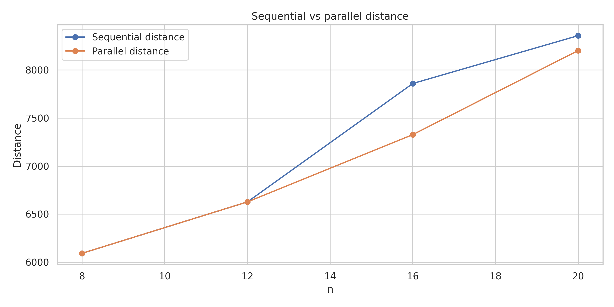
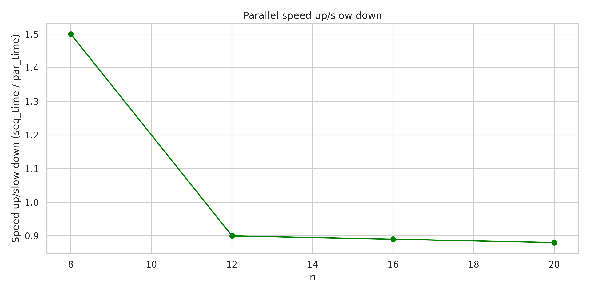
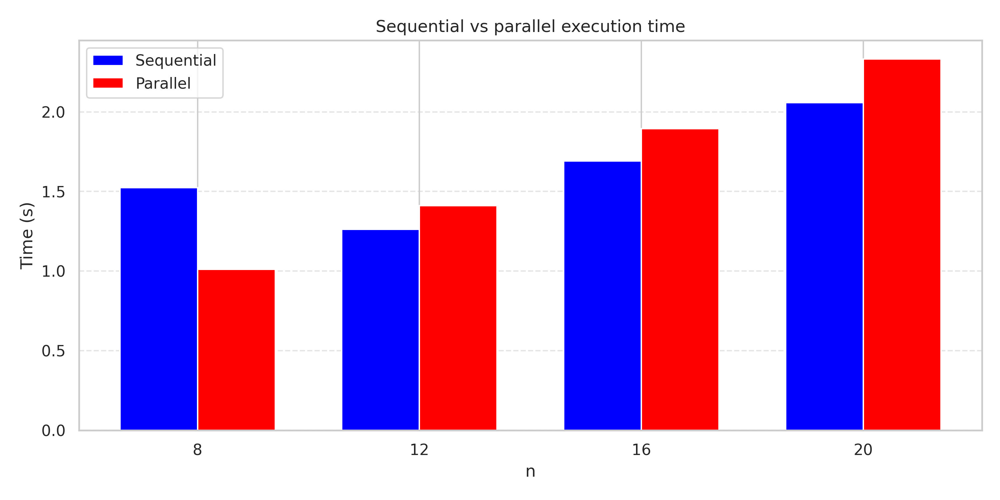

# Simulated Annealing in Rust 👨🏻‍🏭

**Course:** Parallel and Distributed Architectures and Languages  
**Student:** Matija Maksimović  
**Project:** Simulated Annealing  

The goal of this project is to solve the **Traveling Salesman Problem (TSP)** in Rust by implementing both sequential and parallel versions of the **Simulated Annealing (SA)** algorithm.  

## Motivation
Simulated Annealing is a **metaheuristic inspired by the physical process of annealing in metallurgy**.  
It is especially suitable for optimization problems like TSP because it:
- Explores the search space widely in the beginning.
- Gradually narrows exploration as the temperature decreases.
- Escapes local minima by probabilistically accepting worse solutions.

The parallel version leverages **multiple independent SA runs** in parallel, increasing the chance of finding high-quality tours while reducing runtime. (embarrassingly parallel solution)

> **The Most Metal Algorithm in Computer Science**:  
> [Watch on YouTube](https://www.youtube.com/watch?v=I_0GBWCKft8)

## Distance
The quality of the solution is measured as the **total distance of the tour**.  
Both sequential and parallel versions typically reach comparable distances, though the parallel implementation benefits from exploring multiple random initializations simultaneously.  

**Notes:**  
- Small instances (`n=8`) often result in identical distances for both approaches.  
- Larger instances (`n ≥ 16`) show more variability, but parallel execution increases the probability of finding shorter tours.

## Speedup / Slowdown

**Notes:**  
- Clear slow down is observed as `n` increases.  
- For larger `n`, the algorithm benefits from parallel exploration but the time needed to set up threads slows it down.

## Execution times
Execution time for sequential and parallel versions was measured for `n = 8, 12, 16, 20`.  

**Notes:**  
- The parallel version increses execution time for larger problem sizes.  
- Overhead of thread management limits benefits.  
- The tradeoff between runtime and solution quality remains favorable for the parallel version.

## Conclusion
- **Simulated Annealing** is a robust approach for solving TSP.  
- The **parallel version** achieves **competitive solution quality**.  
- The algorithm is **metal** 🤘. 